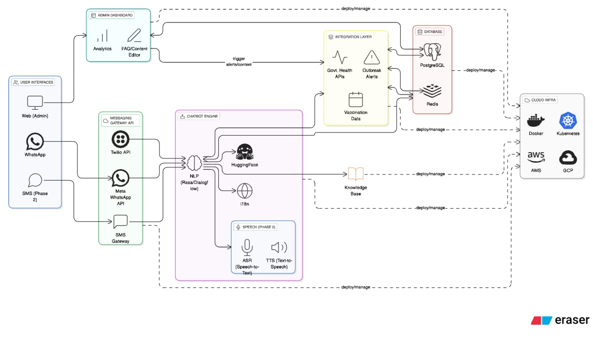

# Niramaya: Disease Outbreak Alert & Health Information System

## Overview
Niramaya is a comprehensive health information and disease outbreak alert system designed for rapid, multilingual, and accessible communication. It integrates a chatbot engine, messaging gateways, admin dashboard, integration with government health APIs, and robust data storage, all deployable on modern cloud infrastructure.

## System Architecture



##demo link : https://demo-sih-one.vercel.app/

**Key Components:**

- **User Interfaces:**
  - Web (Admin)
  - App (User Mobile App)
  - WhatsApp
  - SMS (Phase 2)

- **Messaging Gateway API:**
  - Twilio API
  - Meta WhatsApp API
  - SMS Gateway

- **Chatbot Engine:**
  - NLP (Rasa/Dialogflow)
  - HuggingFace (for advanced NLP)
  - i18n (Internationalization)
  - Speech (Phase 2):
    - ASR (Speech-to-Text)
    - TTS (Text-to-Speech)

- **Admin Dashboard:**
  - Analytics
  - FAQ/Content Editor

- **Integration Layer:**
  - Government Health APIs
  - Outbreak Alerts
  - Vaccination Data

- **Database:**
  - PostgreSQL
  - Redis

- **Knowledge Base:**
  - Centralized health and outbreak information

- **Cloud Infrastructure:**
  - Docker, Kubernetes
  - AWS, GCP

> **Note:** The architecture diagram above (work-flow.jpg) visually represents the flow between all major system components, including user interfaces (web, mobile app, WhatsApp, SMS), messaging gateways, chatbot engine, admin dashboard, integration layer, database, and cloud infrastructure.

## How It Works
- Users interact via WhatsApp, Web, Mobile App, or SMS (future phase).
- Messages are routed through messaging gateways (Twilio, Meta, SMS Gateway).
- The chatbot engine (Rasa/Dialogflow) processes queries, leveraging NLP, internationalization, and (in future) speech capabilities.
- The chatbot accesses the knowledge base and triggers alerts/content via the integration layer.
- The integration layer connects to government health APIs, outbreak alert sources, and vaccination data.
- All data is stored and managed in PostgreSQL and Redis.
- Admins use the dashboard for analytics and content management.
- The entire system is containerized and can be deployed on Docker, Kubernetes, AWS, or GCP.

## Features
- Multilingual, multi-platform chatbot
- Real-time outbreak alerts and health data
- Admin dashboard for analytics and content management
- Integration with government health APIs
- Speech support (planned)
- Scalable, cloud-native deployment

## Folder Structure
```
SIH_2025-main/
├── backend/         # Node.js/Express backend API
│   ├── Dockerfile
│   ├── package.json
│   └── sql/
│       └── init.sql
├── chatbot/         # Rasa chatbot
│   ├── actions/
│   │   └── actions.py
│   ├── config.yml
│   ├── data/
│   │   ├── nlu.yml
│   │   ├── rules.yml
│   │   └── stories.yml
│   ├── Dockerfile
│   ├── domain.yml
│   └── requirements.txt
├── docker-compose.yml
└── README.md
```

## Getting Started

### Prerequisites
- [Docker](https://www.docker.com/get-started)
- [Docker Compose](https://docs.docker.com/compose/)

### Setup & Run
1. **Clone the repository:**
   ```sh
   git clone <repo-url>
   cd SIH_2025-main
   ```
2. **Start all services:**
   ```sh
   docker-compose up --build
   ```
3. **Access services:**
   - Backend API: [http://localhost:3000](http://localhost:3000)
   - Chatbot (Rasa): [http://localhost:5005](http://localhost:5005)
   - PostgreSQL: localhost:5432 (user: niramaya_user, password: secure_password)
   - Redis: localhost:6379

### Environment Variables
- Set `WEBHOOK_VERIFY_TOKEN` in your environment for secure webhook integration.

## Usage
- Interact with the chatbot for disease info, vaccination schedules, and reporting outbreaks.
- Backend API endpoints (see backend code for details) for user, health data, and alert management.
- Extend chatbot intents/entities in `chatbot/domain.yml` and NLU data in `chatbot/data/nlu.yml`.

## Customization
- Add new diseases, vaccines, or languages by updating the database and chatbot training data.
- Integrate with messaging platforms (e.g., WhatsApp, Telegram) via backend webhooks.

## Contributing
Pull requests are welcome! For major changes, please open an issue first to discuss what you would like to change.

## Planning
[MIT](LICENSE)
